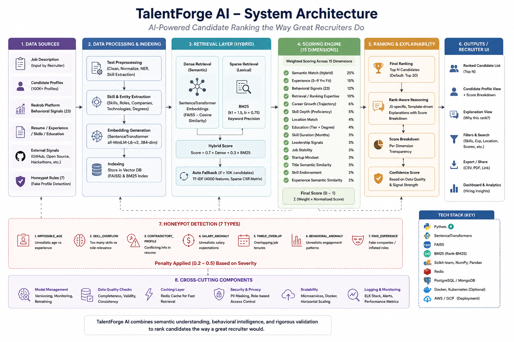
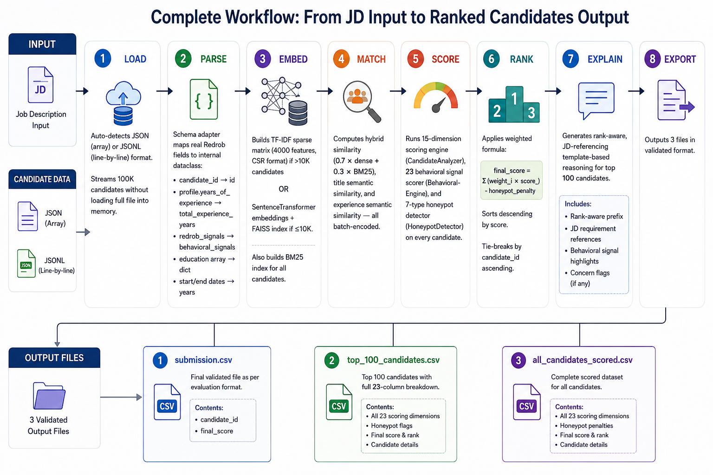
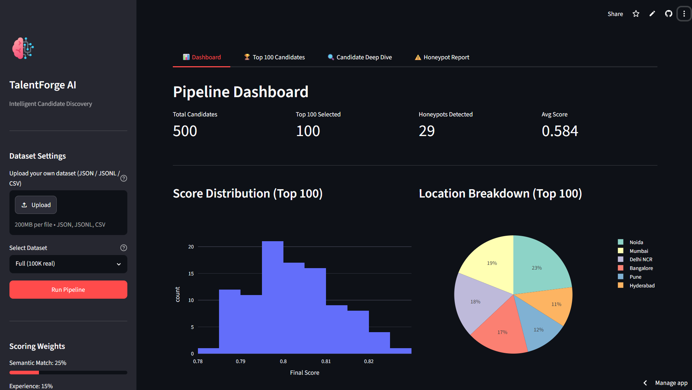
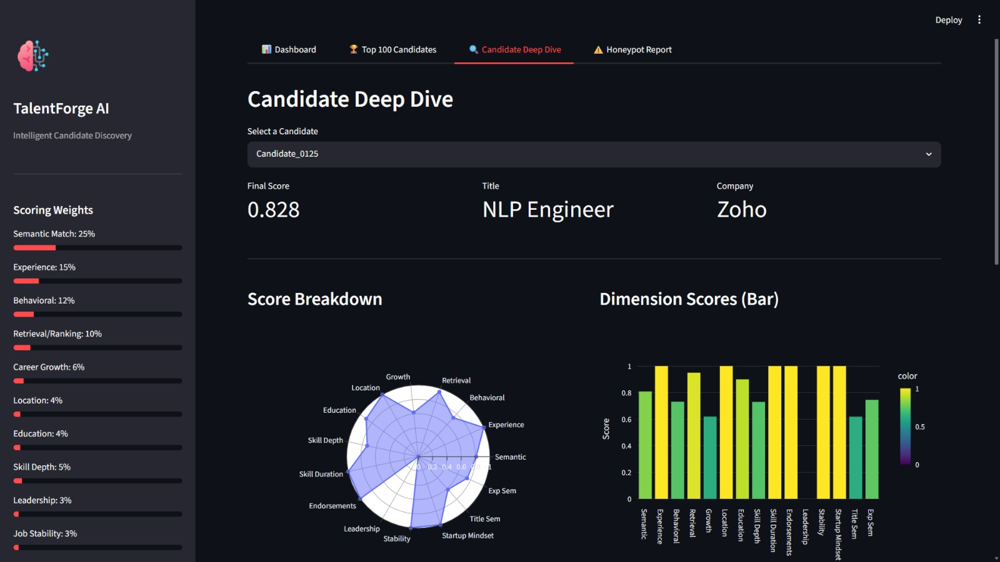
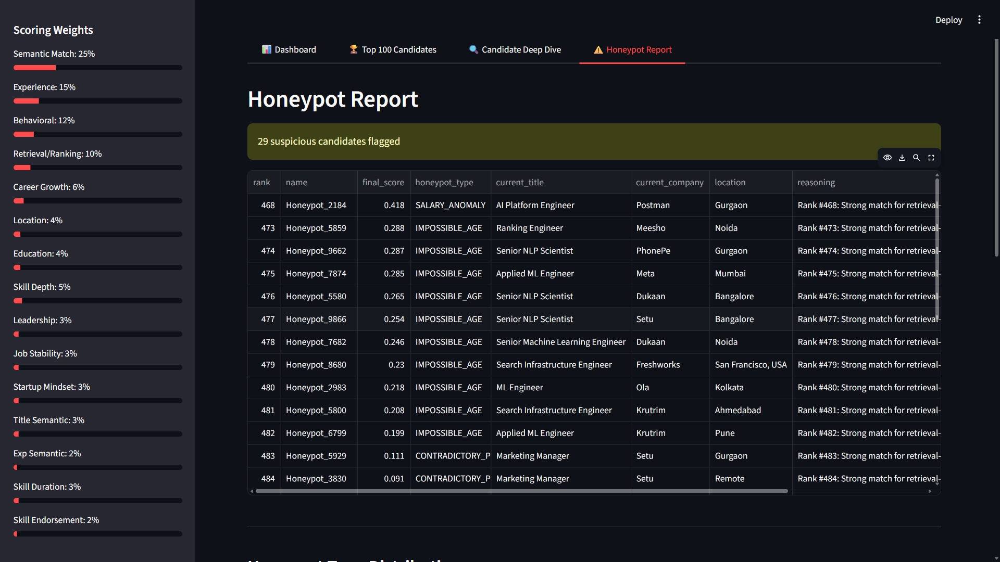
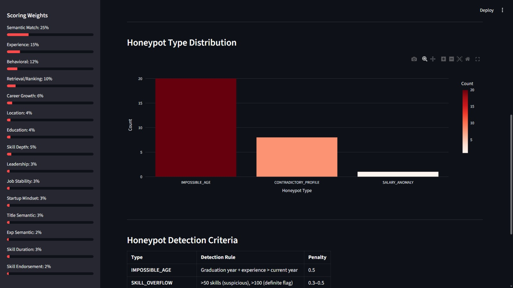
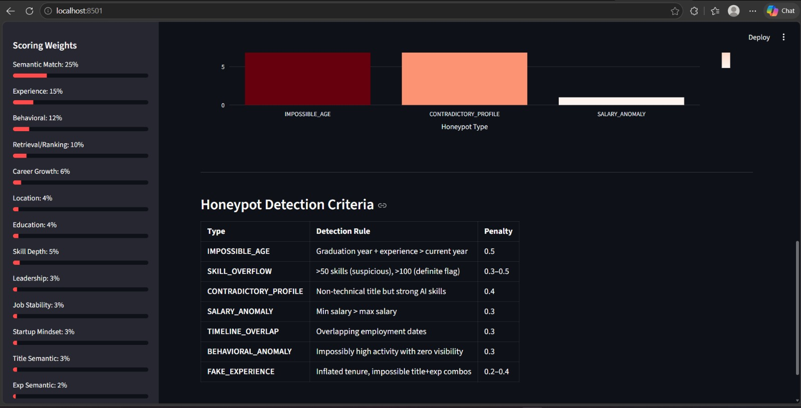

# 🚀 TalentForge AI – Intelligent Candidate Ranking System

### Beyond Keyword Matching – Semantic, Behavioral & Explainable AI for Intelligent Hiring

> **Redrob AI Challenge 2026 Submission**
> 👥 Team Name:- TalentForge_AI

TalentForge AI is an end-to-end AI-powered recruitment system that ranks candidates the way an experienced recruiter would—not by matching keywords, but by understanding semantic relevance, behavioral signals, career progression, and overall role fit.

---

# ✨ Key Features

* 🧠 Hybrid Semantic Retrieval (SentenceTransformer + BM25 + FAISS)
* 📊 15-Dimensional Candidate Scoring Engine
* 🎯 23 Behavioral Signal Analysis
* 🛡️ 7-Type Honeypot & Fake Profile Detection
* 💬 Explainable AI with Rank-Aware Reasoning
* ⚡ CPU-Optimized (No GPU Required)
* 🌐 Fully Offline (No External APIs)
* 📈 Interactive Streamlit Dashboard
* 📦 Supports 100K+ Candidate Profiles

---

# 🏗️ System Overview

<p align="center">
  
</p>

TalentForge AI follows an end-to-end pipeline that parses job descriptions, retrieves candidates using hybrid semantic search, scores candidates across multiple dimensions, detects suspicious profiles, generates explainable AI reasoning, and exports ranked results.

TalentForge AI follows an end-to-end pipeline that parses job descriptions, retrieves candidates using hybrid semantic search, scores candidates across multiple dimensions, detects suspicious profiles using honeypot detection, generates explainable AI reasoning, and exports ranked results through validated CSV files and an interactive Streamlit dashboard.

## 📂 Project Structure

```text
TalentForge-AI-Recruitment-Redrob-Challenge/
│
├── .vscode/
│
├── assets/
│   ├── Workflow.png
│   ├── system_architecture.png.png
│   ├── ranking_results.png.png
│   ├── dashboard_1.png.png
│   ├── dashboard_2.png.png
│   ├── dashboard_3.png.png
│   ├── dashboard_4.png.png
│   ├── dashboard_5.png.png
│   └── .gitkeep
│
├── data/
│   ├── candidates.json
│   ├── generate_candidates.py
│   └── job_description.txt
│
├── output/
│   ├── top_100_candidates.csv
│   ├── all_candidates_scored.csv
│  
│
├── src/
│   ├── __init__.py
│   ├── parser.py
│   ├── retrieval.py
│   ├── semantic_matcher.py
│   ├── feature_engineering.py
│   ├── candidate_analyzer.py
│   ├── behavioral_engine.py
│   ├── honeypot_detector.py
│   ├── scorer.py
│   ├── reasoning_generator.py
│   └── rank.py
│
├── app.py
├── run_submission.py
├── validate_submission.py
├── candidate_schema.json
├── sample_candidates.json
├── submission.csv
├── submission_metadata_template.yaml
├── job_description.docx
├── PROJECT_EXPLANATION.md
├── requirements.txt
├── README.md
└── .gitignore
```

# 🛠️ Technology Stack

| Technology          | Purpose                  |
| ------------------- | ------------------------ |
| Python 3.10+        | Core Backend             |
| SentenceTransformer | Semantic Embeddings      |
| FAISS (CPU)         | Vector Similarity Search |
| BM25                | Sparse Retrieval         |
| TF-IDF              | Large Dataset Fallback   |
| Scikit-learn        | ML Utilities             |
| Pandas & NumPy      | Data Processing          |
| SciPy Sparse        | Memory Optimization      |
| Streamlit           | Interactive Dashboard    |
| Plotly              | Data Visualization       |

---

# ⚙️ Installation

```bash
git clone https://github.com/dhiraj-rathod-dev/TalentForge-AI-Recruitment-Redrob-Challenge.git

cd TalentForge-AI-Recruitment-Redrob-Challenge

pip install -r requirements.txt
```

---

# ▶️ Running the Project

## Rank 100K Candidate Dataset

```bash
python run_submission.py --candidates ./candidates.jsonl --out ./submission.csv
```

---

## Generate Synthetic Dataset

```bash
python data/generate_candidates.py
python src/rank.py
```

---

## Launch Dashboard

```bash
python -m streamlit run app.py
```

---


# 🔄 End-to-End Workflow

The following workflow illustrates the complete TalentForge AI candidate ranking pipeline, from job description parsing to explainable candidate ranking.

<p align="center">
  
</p>

---

# 🖥️ Streamlit Dashboard

TalentForge AI provides an interactive Streamlit dashboard for exploring ranked candidates, score distributions, behavioral insights, and explainable AI reasoning.

## Candidate Ranking Dashboard

<p align="center">
  
</p>

---

## Candidate Score Analytics

<p align="center">
  
</p>

---

## Skill & Experience Analysis

<p align="center">
  
</p>

---

## Ranking Insights

<p align="center">
  
</p>

---

## Explainable AI Reasoning

<p align="center">
  
</p>

---

# 📁 Generated Outputs

```text
submission.csv               # Final validated submission
top_100_candidates.csv       # Top 100 ranked candidates
all_candidates_scored.csv    # Complete scored dataset
```


# 📊 Scoring Framework

TalentForge evaluates every candidate using **15 weighted dimensions**.

| Category                   |       Weight |
| -------------------------- | -----------: |
| Semantic Match             |          25% |
| Experience                 |          15% |
| Behavioral Signals         |          12% |
| Retrieval / Ranking Skills |          10% |
| Career Growth              |           6% |
| Skill Depth                |           5% |
| Location                   |           4% |
| Education                  |           4% |
| Leadership                 |           3% |
| Startup Mindset            |           3% |
| Job Stability              |           3% |
| Skill Duration             |           3% |
| Title Similarity           |           3% |
| Skill Endorsements         |           2% |
| Experience Similarity      |           2% |
| Honeypot Penalty           | -0.0 to -0.5 |

---

# 🛡️ Honeypot Detection

TalentForge detects **7 types of suspicious profiles**:

* Impossible Age
* Skill Overflow
* Contradictory Profile
* Salary Anomaly
* Timeline Overlap
* Behavioral Anomaly
* Fake Experience

---

# 📈 Performance

| Metric            | Result                |
| ----------------- | --------------------- |
| Dataset Size      | 100,000 Candidates    |
| Runtime           | 176.03 sec (2.93 min) |
| Peak RAM          | ~3 GB                 |
| GPU Required      | ❌ No                  |
| Internet Required | ❌ No                  |
| External APIs     | ❌ None                |
| Output Validation | ✅ Passed              |

---

# 🎯 Why TalentForge AI?

| Traditional ATS           | TalentForge AI               |
| ------------------------- | ---------------------------- |
| Keyword Matching          | Hybrid Semantic Retrieval    |
| Binary Filtering          | Multi-Dimensional Scoring    |
| No Behavioral Analysis    | 23 Behavioral Signals        |
| No Explainability         | Rank-Aware AI Reasoning      |
| No Fake Profile Detection | 7 Honeypot Detectors         |
| Basic Ranking             | Transparent Weighted Ranking |

---

---
---

# 👨‍💻 Developed By

<table>
<tr>
<td align="center">
<a href="https://github.com/dhiraj-rathod-dev">
<br />
<b>Dhiraj Rathod</b>
</a>
<br />
<a href="https://github.com/dhiraj-rathod-dev">GitHub Profile</a>
</td>

<td align="center">
<a href="https://github.com/shravanisakore">
<br />
<b>Shravani Sakore</b>
</a>
<br />
<a href="https://github.com/shravanisakore">GitHub Profile</a>
</td>
</tr>
</table>

### 📂 Repository

🔗 **https://github.com/dhiraj-rathod-dev/TalentForge-AI-Recruitment-Redrob-Challenge**

---

# 📈 Contributors

<a href="https://github.com/dhiraj-rathod-dev/TalentForge-AI-Recruitment-Redrob-Challenge/graphs/contributors">
  
</a>

**Contributor Statistics**

- 👨‍💻 Dhiraj Rathod
- 👩‍💻 Shravani Sakore

View detailed contribution history here:

🔗 https://github.com/dhiraj-rathod-dev/TalentForge-AI-Recruitment-Redrob-Challenge/graphs/contributors

---

## 📄 License & Copyright

© 2026 **Dhiraj Rathod & Shravani Sakore**. All Rights Reserved.

This project was developed as part of the **Redrob AI Challenge 2026**.

Unauthorized copying, modification, or redistribution of this repository or its contents without prior permission is prohibited.

---

<div align="center">

## ⭐ Support the Project

If you found **TalentForge AI** useful, please consider giving this repository a ⭐ on GitHub.

### TalentForge AI
### Beyond Keyword Matching: Semantic, Behavioral & Explainable AI for Intelligent Hiring

Made with ❤️ by **Dhiraj Rathod** & **Shravani Sakore**

<a href="https://github.com/dhiraj-rathod-dev/TalentForge-AI-Recruitment-Redrob-Challenge">

</a>

<a href="https://github.com/dhiraj-rathod-dev/TalentForge-AI-Recruitment-Redrob-Challenge/fork">

</a>

<a href="https://github.com/dhiraj-rathod-dev/TalentForge-AI-Recruitment-Redrob-Challenge/issues">

</a>

</div>

